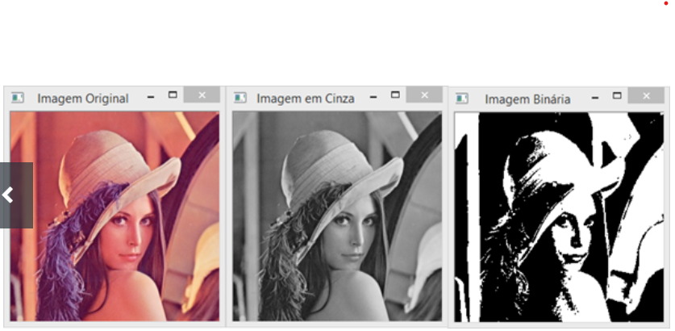

# Descrição do Desafio

Seguindo o exemplo do algoritmo de binarização apresentado em nossa última aula, realize a implementação em Python para transformar uma imagem colorida para níveis de cinza (0 a 255) e para binarizada (0 e 255), preto e branco.  

 

Por meio da imagem é possível visualizar os dois casos esperados:

Figura 1: Lena colorida (imagem de entrada), em níveis de cinza e preto e branca. 